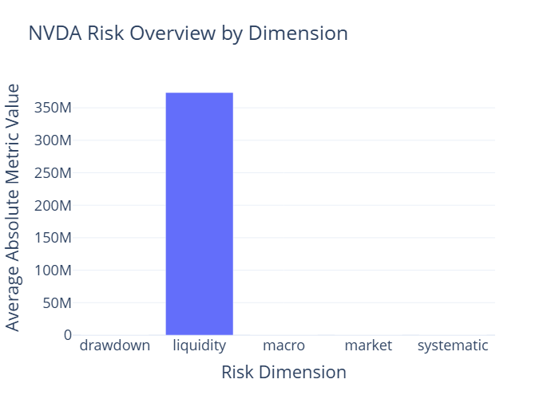

# NVDA Risk Analysis Project

Reproducible, diagnostics-first risk analysis of NVIDIA (`NVDA`) across market,
liquidity, drawdown, systematic, and macro dimensions.



## Why This Project Stands Out

This repository turns a single-stock risk study into an engineering pipeline that can be
re-run end to end. The focus is not only on model outputs, but on whether every figure,
table, and summary can be audited, reproduced, and trusted.

- Offline-first data workflow with deterministic source priority.
- Unified daily and monthly panels that feed every downstream module.
- Diagnostics, provenance, and scorecards shipped as public artifacts.

## At a Glance

- Sample window: `2020-01-01` to `2024-12-31`
- Risk modules: market, liquidity, drawdown, systematic, macro
- Latest diagnostics result: `32/32` quality gates passing
- Latest local verification baseline: `133` tests passed with `92.65%` coverage

## Selected Outputs

| Area | Current headline result |
|:-----|:------------------------|
| Market risk | Annualized volatility `33.3%`; historical VaR (95%) `-13.8%`; ES `-17.3%` |
| Liquidity risk | Median dollar volume about `$746.9M` |
| Drawdown risk | Maximum drawdown `-23.8%`; latest drawdown `-22.8%` |
| Systematic risk | Static beta estimate `-0.356` on the configured sample |
| Macro risk | DGS10 coefficient `0.175` with low explanatory power (`R^2 = 0.0007`) |

These values come from `documents/tables/estimation_results.md` and are paired with
`documents/tables/diagnostics.md`, which records model status, fallback events, and
cross-artifact consistency checks.

## Public-Facing Artifacts

- Paper source: `documents/paper.md`
- Presentation export: `presentation.pdf`
- Figures: `documents/public/fig_*.png`
- Diagnostics report: `documents/tables/diagnostics.md`
- Risk summary table: `documents/tables/estimation_results.md`

## Project Pipeline

`data_management -> analysis -> final -> documents`

- `src/nvda_risk_project/data_management`: download, clean, align, and provenance tasks
- `src/nvda_risk_project/analysis`: risk models and analysis tasks
- `src/nvda_risk_project/final`: figures, tables, diagnostics, and scorecard outputs
- `documents`: paper, presentation, and exported public assets
- `tests`: unit, integration, and end-to-end coverage

## Reproducibility Design

Data acquisition follows a strict priority:

1. cached raw files in `bld/data/raw`
2. repository snapshots in `src/nvda_risk_project/data/snapshots`
3. online download via `yfinance` as a last resort

Each build emits auditable metadata and quality checks:

- `bld/data/clean/data_provenance.json`
- `bld/metrics/diagnostics.csv`
- `bld/checks/scorecard.json`

## Quick Start

```bash
pixi install
pixi run npm install
pixi run pytest -q
pixi run pytask
```

Preview and rebuild report artifacts:

```bash
pixi run view-paper
pixi run view-pres
pixi run pytask -k diagnostics --force
pixi run pytask -k figure --force
```

Build the project docs site:

```bash
pixi run docs
pixi run view-docs
```
