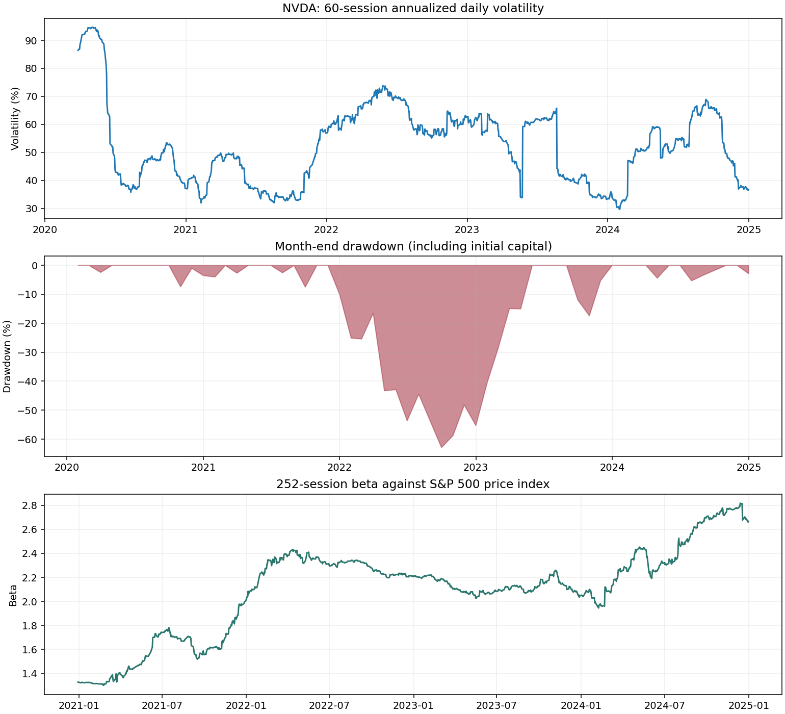
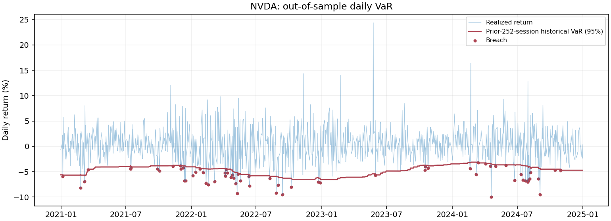

# NVIDIA Risk Analytics — Python Portfolio

**A reproducible analysis of downside risk, market exposure and model coverage using observed NVDA, S&P 500 and US Treasury data.**

This independent portfolio project demonstrates how I turn financial data into auditable analysis and decision-focused reporting. It is relevant to junior data analyst, financial analyst and risk analyst roles, with transferable data preparation and reporting skills for BI work.

**Start here:** [Results and interpretation](documents/verified/RESULTS.md) · [Analysis code](scripts/verified_analysis.py) · [Data sources](data/verified/sources.json) · [Validation checks](documents/verified/validation.json)



## Business Questions

For an analyst reviewing a concentrated equity exposure, average returns alone do not answer the questions that matter:

- How large have downside losses and drawdowns been?
- How sensitive is the asset to market movements, and does that exposure change?
- Do historical and normal VaR models achieve their stated coverage on unseen days?
- Can another analyst trace the data, reproduce the results and inspect the assumptions?

The project addresses these questions with a consistent data panel, explicit risk metrics and a chronological backtest. It is an analytical case study, not a record of managing a client portfolio or delivering a commercial BI implementation.

## Key Findings

Observed sample: **2 January 2020–31 December 2024**, comprising **1,258 trading sessions** and **60 monthly observations**. All returns are in USD.

| Measure | Result | Interpretation |
|---|---:|---|
| Annualized volatility from monthly returns | 49.87% | Substantial variability; a starting point for exposure sizing |
| Daily historical VaR / ES at 95% | −5.09% / −6.94% | ES measures the average loss beyond the estimated downside threshold |
| Monthly historical VaR / ES at 95% | −16.99% / −23.46% | Downside severity is materially larger at a monthly horizon |
| Maximum month-end drawdown | −62.82% | A large peak-to-trough decline; month-end sampling can miss deeper intramonth losses |
| Monthly raw-return beta against S&P 500 | 1.640 | Positive sensitivity to broad market returns over the sample |
| Latest 252-session daily beta | 2.666 | Recent measured exposure differs from the full-sample monthly estimate |

VaR and ES are **negative return thresholds**. Historical estimates are not guarantees about future losses. Full precision is available in [metrics.json](documents/verified/metrics.json).

As a hypothetical illustration, applying the daily 95% historical estimates to a USD 100,000 exposure corresponds to approximately **USD 5,091 VaR** and **USD 6,943 ES**. This excludes currency risk, execution costs and diversification.

## Testing Risk Models on Unseen Days

Each prediction uses the **previous 252 sessions only**. The forecast period is 31 December 2020–31 December 2024, with **1,006 predictions per model and confidence level**. Both models are evaluated on identical dates.

| Model | Confidence | Breaches / forecasts | Breach rate | Expected rate | Kupiec p-value |
|---|---:|---:|---:|---:|---:|
| Historical | 95% | 65 / 1,006 | 6.46% | 5% | 0.0415 |
| Historical | 99% | 18 / 1,006 | 1.79% | 1% | 0.0235 |
| Normal | 95% | 51 / 1,006 | 5.07% | 5% | 0.9195 |
| Normal | 99% | 15 / 1,006 | 1.49% | 1% | 0.1445 |

The historical model breaches more often than its nominal rates, and the Kupiec coverage test rejects at 5% for both confidence levels. The normal model's coverage is not rejected on this sample. This does **not** establish independence of breaches, ES calibration or future superiority.

Every forecast includes its training dates, VaR, ES estimate and realized return in [oos_forecasts.csv](documents/verified/oos_forecasts.csv).



## Methods and Python Skills Demonstrated

| Capability | Evidence in this repository |
|---|---|
| Data acquisition and provenance | Archived Yahoo chart responses and FRED DGS10 CSV; URLs, retrieval time and SHA-256 checks |
| pandas data preparation | Date normalization, exchange-session validation, adjusted-price returns, joins and monthly compounding |
| NumPy and SciPy analysis | Historical quantiles, normal VaR/ES, volatility, drawdown and likelihood-based coverage tests |
| statsmodels regression | Descriptive return–yield regression with HAC standard errors; explicit units and inference limits |
| Time-series validation | Rolling estimation with training strictly before each forecast date |
| Visualization and reporting | Matplotlib charts with explicit units; generated Markdown, JSON and CSV outputs |
| Software quality | Pytest checks for look-ahead errors, compounding, tampered inputs, missing sessions and complete builds; GitHub Actions |

These are demonstrated Python and analytical reporting capabilities. SQL data modeling and a Power BI dashboard are possible extensions; they are not implemented deliverables in this repository.

## Reproduce the Observed-Data Analysis

Use **Python 3.12** and a separate virtual environment. The verified workflow does not require the legacy Pixi, browser-export or LaTeX toolchain.

```bash
git clone https://github.com/liangchen-andy/nvda_risk_project.git
cd nvda_risk_project
python -m venv .venv
```

Activate the environment using the command for your operating system:

```bash
# Windows PowerShell
.venv\Scripts\Activate.ps1

# macOS / Linux
source .venv/bin/activate
```

Install dependencies, run checks and rebuild:

```bash
python -m pip install -r requirements-verified.txt
python -m pytest -o addopts='' tests/verified -q
python scripts/verified_analysis.py
```

Archived responses allow an **offline analysis build after dependency installation**. Missing, altered or malformed input stops the build; there is no synthetic fallback. The verified workflow has **7 passing targeted tests** and **8 passing build validation checks**. These counts are not a full-repository coverage claim.

To deliberately retrieve a new vendor vintage:

```bash
python scripts/verified_analysis.py --refresh
```

Review the source ledger and regenerated outputs before committing a refresh. Vendor revisions can change adjusted prices and results. Update README findings when the archived data or analysis assumptions change.

## Data and Assumptions

- **Prices:** Yahoo Finance chart responses for `NVDA` and `^GSPC`, with adjusted closes for returns and pre-sample observations for the genuine first return.
- **Calendar:** XNYS sessions; weekends and exchange holidays are not observations.
- **Monthly returns:** compounded daily returns, checked against adjusted month-end price ratios. Volatility is monthly standard deviation multiplied by √12.
- **Benchmark:** S&P 500 price index. Beta uses raw returns, not risk-free-adjusted CAPM returns; monthly and daily-window estimates are different quantities.
- **Macro:** real FRED `DGS10`, measured in percentage points. Alignment uses the current or earlier observation, with a seven-day limit and no future filling. The regression is descriptive, not causal or a real-time forecast.
- **Liquidity:** price × volume is a turnover proxy. Vendor split/volume conventions require review before treating it as execution capacity.

The descriptive yield-level regression has very low explanatory power (R² ≈ 0.000047; HAC p-value ≈ 0.778). It provides no strong evidence of a simple linear daily return–yield-level relationship in this sample.

## Repository Guide and Data Correction

| Path | Purpose |
|---|---|
| `scripts/verified_analysis.py` | Current observed-data analysis and output generation |
| `data/verified/` | Archived observed inputs and source ledger |
| `documents/verified/` | Current results, panels, forecasts, validation and figures |
| `tests/verified/` | Regression tests for the observed-data workflow |
| `src/nvda_risk_project/` | Original modular Pytask pipeline, retained as a legacy demonstration |
| `documents/DATA_AUDIT.md` | Data correction and remaining legacy limitations |

**Earlier public results were generated from synthetic price snapshots and artificial macro inputs.** They are retained for traceability, but are not observed NVIDIA risk findings. The original paper, presentation, root PDFs, `documents/public/` and `documents/tables/` belong to that legacy demonstration. Its passing consistency checks did not establish data authenticity. See the [data audit](documents/DATA_AUDIT.md).

The verified workflow currently compares historical and normal VaR. Legacy GARCH results are excluded. Further work could add GARCH with explicit convergence handling, independence and ES tests, EUR exposure analysis, and a SQL/Power BI reporting layer.

**Author:** Liangchen Chen
